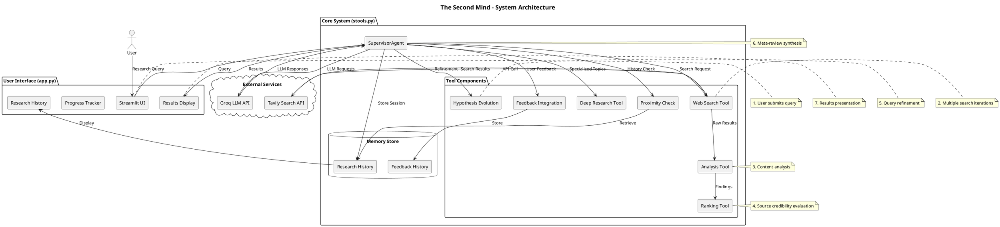

```plantuml
@startuml The Second Mind Architecture

' Styling
skinparam componentStyle rectangle
skinparam backgroundColor white
skinparam titleFontSize 18
skinparam defaultTextAlignment center

title The Second Mind - System Architecture

' Actor
actor "User" as user

' User Interface
package "User Interface (app.py)" {
  [Streamlit UI] as ui
  [Progress Tracker] as progress
  [Results Display] as display
  [Research History] as history_ui
}

' Core System
package "Core System (stools.py)" {
  [SupervisorAgent] as supervisor
  
  package "Tool Components" {
    [Web Search Tool] as web_search
    [Analysis Tool] as analysis
    [Ranking Tool] as ranking
    [Hypothesis Evolution] as hypothesis
    [Feedback Integration] as feedback
    [Deep Research Tool] as deep_research
    [Proximity Check] as proximity
  }
  
  ' Memory System
  database "Memory Store" {
    [Research History] as history
    [Feedback History] as feedback_history
  }
}

' External Services
cloud "External Services" {
  [Groq LLM API] as groq
  [Tavily Search API] as tavily
}

' Relationships & Data Flow
user --> ui : Research Query
ui --> supervisor : Query
supervisor --> web_search : Search Request
web_search --> tavily : API Call
tavily --> web_search : Search Results
web_search --> analysis : Raw Results
analysis --> ranking : Findings
supervisor --> hypothesis : Refinement
supervisor --> proximity : History Check
proximity --> history : Retrieve
supervisor --> deep_research : Specialized Topics
supervisor --> feedback : User Feedback
feedback --> feedback_history : Store
supervisor --> groq : LLM Requests
groq --> supervisor : LLM Responses
supervisor --> display : Results
supervisor --> history : Store Session
history --> history_ui : Display

' Process Flow (numbering)
ui -[hidden]-> supervisor
note right of ui : 1. User submits query
note right of web_search : 2. Multiple search iterations
note right of analysis : 3. Content analysis
note right of ranking : 4. Source credibility evaluation
note left of hypothesis : 5. Query refinement
note right of supervisor : 6. Meta-review synthesis
note right of display : 7. Results presentation

@enduml
``` 